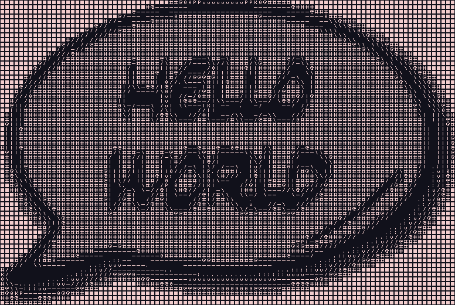
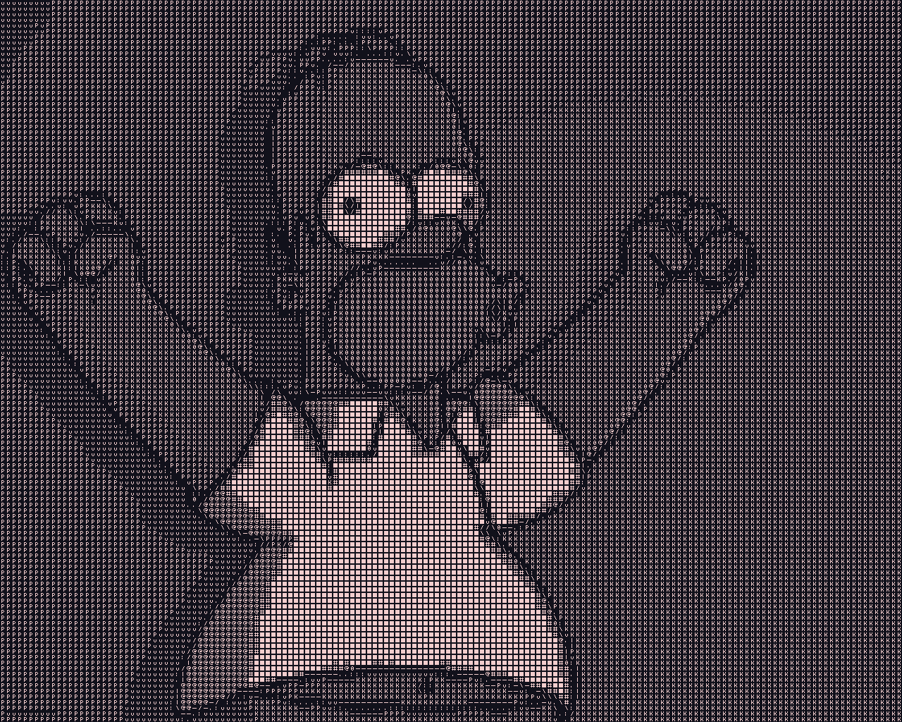

# Yet another ascii art generator

## Description:

Hello! I decided to make an ascii art generator in C++. I use the stbi image header files for my image reading and writing purposes. This project was inspired heavily by Acerola's video about ascii art shaders and I used may of the techniques he suggests in his video like a diference of gausians and sobel filter for edges. With that being said all of the code is mine which will become painfully obvious if you take a look at it. It is not clean or efficient but if its stupid and it works, is it really stupid?

## How to use?

### Compilation: 

Simply run `cmake ./ && make` to create the `Makefile` and `make` the `ascii` binary. Then execute with `./ascii` and do as prompted.

### Use:

Run `./ascii` and follow the prompts it gives, to be safe only use downscaling factors that are multiples of 8. If you want to change the ascii characters that are used or the color that they are, simply change the `palette.png` image or create your own and name it `palette.png`.

## Examples and Extra Info:

I have included some demo images in the `Examples` directory and their ascii counter parts. These have worked well in my opinion due to high contrast edges which make everything easier to see.

This program does have the functionality of converting many images in a sequence to create a video however that functionality is quite messy and I want to rewrite the whole thing before that is fully working. I will be able to write more efficient stuff code and properly implement multithreading.